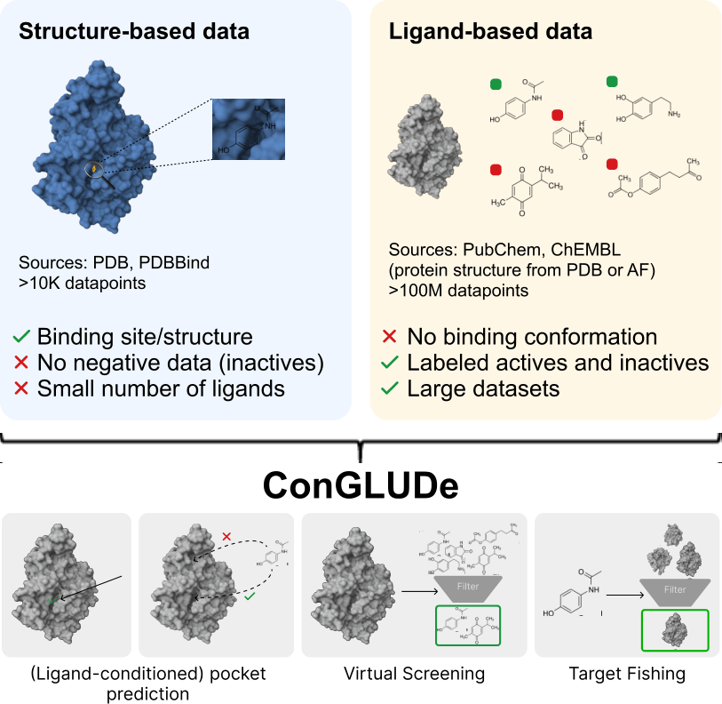

<div align="center">

# ConGLUDe

### **Con**trastive **G**eometric **L**earning Unlocks **U**nified Structure- and Ligand-Based **D**rug D**e**sign

  
</div>

**ConGLUDe** is a single contrastive geometric architecture that unifies structure- and ligand-based data and tasks. It couples a geometric protein encoder that produces whole-protein representations and implicit embeddings of predicted binding sites with a fast ligand encoder. By aligning ligands with both global protein representations and multiple candidate binding sites through contrastive learning, ConGLUDe supports a variety of drug discovery tasks, including virtual screening, target fishing, binding site prediction, and ligand-conditioned pocket ranking. 

📄 [**Link to paper**](https://arxiv.org/abs/2601.09693)

---

## ⚙️ Environment Set-Up

Clone the repository:

```bash
git clone https://github.com/ml-jku/conglude.git
cd ConGLUDe
```

The following creates and activates a conda environment with all necessary dependencies including the ConGLUDe source code:

```
bash setup_env.sh
conda activate conglude
```

---

## 📥 Download Data

The evaluation datasets corresponding to this repository are available [here](https://zenodo.org/records/18933183).

To download and unzip all datasets into the default data folder, run:

```bash
python download_data.py
```

You can download individual datasets by specifying the --dataset_name argument. For example, to download the LIT-PCBA dataset:

```bash
python download_data.py --dataset_name litpcba
```

Available datasets: `litpcba`, `dude`, `kinobeads`, `pdbbind_time`, `posebusters`, `asd`, `coach420`, `holo4k`, `pdbbind_refined`

---

## ✅ Reproduce Paper Results

To reproduce the results reported in the paper, use the evaluation script:

```bash
python eval.py
```

---

## 📊 Evaluate a New Dataset

You can evaluate a custom labeled dataset with ConGLUDe by following these steps:

#### Step 1 — Create a dataset folder for your dataset: 

`data/datasets/test_datasets/<dataset_name>`

#### Step 2 - Add required files:

At minimum, include `info/proteins.txt`. This file must contain a list of **PDB IDs** (one per line).
If ligands cannot be extracted directly from the PDB files, provide active and inactive molecules for each protein:

`raw/smiles_files/<pdb_id>/actives.txt` \
`raw/smiles_files/<pdb_id>/inactives.txt`

#### Step 3 - Create a YAML configuration for your dataset: 

`configs/datamodule/test_datasets/{dataset_name}/{dataset_name}.yaml`

For details on configuration parameters see [`conglude/utils/data_processing.py`](conglude/utils/data_processing.py) and [`conglude/datamodule.py`](conglude/datamodule.py).

#### Step 4 - Register the dataset:

Add your dataset name to `configs/datamodule/test_datasets.yaml`.

#### Step 5 - Run the evaluation script.

```bash
python eval.py
```

---

## 🧬 Embed Proteins

To generate ConGLUDe protein and pocket embeddings for a custom dataset, first, create a file listing the PDB IDs of the proteins you want to embed (one PDB ID per line): `data/datasets/predict_datasets/<dataset_name>/info/proteins.txt`

By default, the corresponding PDB files are automatically downloaded from [https://www.rcsb.org/](https://www.rcsb.org/). If you already have PDB files locally, specify the directory when running the script.

```bash
python embed_proteins.py --dataset_name <dataset_name> --pdb_dir <path_to_pdbs>
```

The output embeddings will be saved in `results/<dataset_name>/<timestamp>/embeddings`.

Additionally, pocket predictions are saved in a data frame `results/<dataset_name>/<timestamp>/predictions/pp_predictions.csv` with the following columns:

| Column                       | Meaning                                                                  |
| ---------------------------- | ------------------------------------------------------------------------ |
| `protein_name`               | PDB ID of the protein                                                    |
| `pocket_name`                | Identifier of the predicted binding pocket                               |
| `pred_x`, `pred_y`, `pred_z` | X, Y and Z-coordinates of the pocket center (in Å)                       |
| `confidence`                 | Confidence score of the pocket prediction (higher = more confident)      |

---

## 🧪 Embed Ligands

To generate ligand embeddings, create a file containing SMILES strings of small molecules: `data/datasets/predict_datasets/<dataset_name>/info/smiles.txt`

Then, run:

```bash
python embed_ligands.py --dataset_name <dataset_name>
```

The output embeddings will be saved as `results/<dataset_name>/<timestamp>/embeddings/ligand_embeddings.npy`.

---

## 🔮 Make Predictions

To make virtual screening and ligand-conditioned pocket ranking predictions, place both `proteins.txt` and `smiles.txt` (as in the previous two sections) in `data/datasets/predict_datasets/<dataset_name>/info/` and run:

```bash
python predict.py --dataset_name <dataset_name>
```

Predictions are saved in `results/<dataset_name>/<timestamp>/predictions/` as `vs_predictions.npy` (protein–ligand similarity matrix) and `pr_predictions.npy` (pocket–ligand similarity matrix).

To match rows of these similarity matrices to protein/pocket names, those are saved in `results/<dataset_name>/<timestamp>/embeddings`. Column ID to SMILES mappings can be found in `data/datasets/predict_datasets/<dataset_name>/processed/ligand_embeddings/index2smiles.json`

---

## 📚 Citation

If you use **ConGLUDe** in your research, please cite:

```bibtex
@misc{schneckenreiter2026conglude,
  title={Contrastive Geometric Learning Unlocks Unified Structure- and Ligand-Based Drug Design},
  author={Lisa Schneckenreiter and Sohvi Luukkonen and Lukas Friedrich and Daniel Kuhn and Günter Klambauer},
  year={2026},
  eprint={2601.09693},
  archivePrefix={arXiv},
  primaryClass={cs.LG},
  url={https://arxiv.org/abs/2601.09693}
}
```