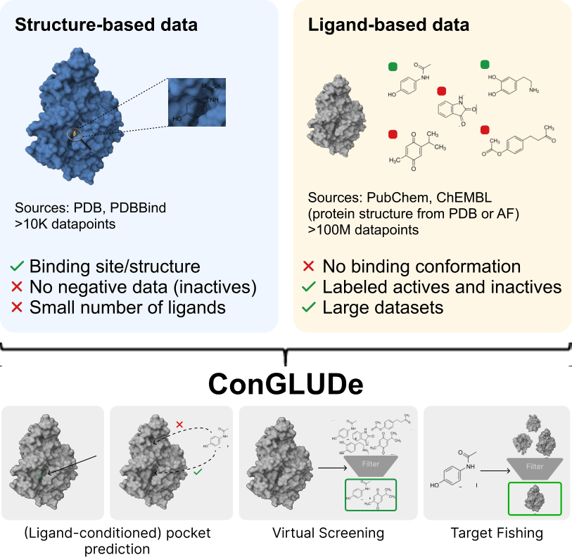

<div align="center">

# ConGLUDe

### **Con**trastive **G**eometric **L**earning Unlocks **U**nified Structure- and Ligand-Based **D**rug D**e**sign

  
</div>

**ConGLUDe** is a single contrastive geometric architecture that unifies structure- and ligand-based data and tasks. It couples a geometric protein encoder that produces whole-protein representations and implicit embeddings of predicted binding sites with a fast ligand encoder. By aligning ligands with both global protein representations and multiple candidate binding sites through contrastive learning, ConGLUDe supports a variety of drug discovery tasks, including virtual screening, target fishing, binding site prediction, and ligand-conditioned pocket ranking. 

📄 [**Link to paper**](https://arxiv.org/abs/2601.09693)

---

## ⚙️ Environment Set-Up

Clone the repository:

```bash
git clone https://github.com/ml-jku/conglude.git
cd conglude
```

The following creates and activates a conda environment with all necessary dependencies including the ConGLUDe source code. Pass a CUDA wheel tag matching your driver (defaults to `cu128`):

```bash
bash setup_env.sh          # default: cu128 (requires driver >= 570.x)
bash setup_env.sh cu121    # for older drivers (CUDA 12.1–12.7)
```

Then activate:

```bash
conda activate conglude
```

---

## 📥 Download Data

The evaluation datasets corresponding to this repository are available [here](https://zenodo.org/records/20354834).

To download and unzip all datasets into the default data folder, run:

```bash
python download_data.py
```

You can download individual datasets or groups by specifying the `--dataset_name` argument:

```bash
python download_data.py --dataset_name litpcba   # single dataset
python download_data.py --dataset_name vs        # group: dude + litpcba
```

Individual datasets: `SB_train_val`, `LB_train_val`, `asd`, `coach420`, `dude`, `holo4k`, `kinobeads`, `litpcba`, `pdbbind_refined`, `pdbbind_time`, `posebusters`

Group aliases:

| Alias | Datasets |
|-------|----------|
| `test` | all 9 test datasets |
| `train` / `train_val` | `SB_train_val`, `LB_train_val` |
| `vs` | `dude`, `litpcba` |
| `tf` | `kinobeads` |
| `pp` | `coach420`, `holo4k`, `pdbbind_refined` |
| `pr` | `asd`, `pdbbind_time`, `posebusters` |

Already-downloaded datasets are automatically skipped.

---

## 🔧 Process Data

All downloaded datasets except `SB_train_val` are already processed. `SB_train_val` must be processed before use (extracting protein graphs, computing ligand features, etc.):

```bash
python process_data.py --dataset_name SB_train_val
```

If you want to reprocess any of the other datasets (e.g. after changing processing parameters), you can run the same script for them:

```bash
python process_data.py                              # all test datasets (default)
python process_data.py --dataset_name train         # group: SB_train_val + LB_train_val
```

The same group aliases as `download_data.py` are supported (`test`, `train`, `vs`, `tf`, `pp`, `pr`).

---

## ✅ Reproduce Paper Results

To reproduce the results reported in the paper, use the evaluation script:

```bash
python eval.py
```

---

## 📊 Evaluate a New Dataset

You can evaluate a custom labeled dataset with ConGLUDe by following these steps:

#### Step 1 — Create a dataset folder for your dataset: 

`data/datasets/test_datasets/<dataset_name>`

#### Step 2 - Add required files:

At minimum, include `info/protein_ids.txt`. This file must contain a list of **PDB IDs** (one per line).
If ligands cannot be extracted directly from the PDB files, provide active and inactive molecules for each protein:

`raw/smiles_files/<pdb_id>/actives.txt` \
`raw/smiles_files/<pdb_id>/inactives.txt`

#### Step 3 - Run the evaluation script:

For a standard virtual screening dataset (binary actives/inactives as above), reuse the generic `default_vs` config and point it at your dataset directory from the command line - no new config file needed:

```bash
python eval.py \
    datamodule.test_datasets.default_vs.dataset_dir=./data/datasets/test_datasets/<dataset_name> \
    +datamodule.test_datasets.default_vs.dataset_name=<dataset_name>
```

If your dataset needs non-default parameters (a different `task`, `structure_based`, `multi_ligand`, `select_chains`, etc.), or you want to evaluate several custom datasets together in a single run, create a dedicated config instead:

1. Add a YAML configuration at `configs/datamodule/test_datasets/{dataset_name}/{dataset_name}.yaml` (see `default_vs.yaml` or the other dataset configs in that folder for examples). For details on configuration parameters see [`conglude/utils/data_processing.py`](conglude/utils/data_processing.py) and [`conglude/datamodule.py`](conglude/datamodule.py).
2. Register it by adding your dataset name to the `defaults` list in `configs/datamodule/test_datasets/test_datasets.yaml`.
3. Run:

```bash
python eval.py
```

---

## 🧬 Embed Proteins

To generate ConGLUDe protein and pocket embeddings for a custom dataset, first, create a file listing the PDB IDs of the proteins you want to embed (one PDB ID per line): `data/datasets/predict_datasets/<dataset_name>/info/protein_ids.txt`

By default, the corresponding PDB files are automatically downloaded from [https://www.rcsb.org/](https://www.rcsb.org/). If you already have PDB files locally, specify the directory when running the script.

```bash
python embed_proteins.py --dataset_dir ./data/datasets/predict_datasets/<dataset_name> --pdb_dir <path_to_pdbs>
```

The output embeddings will be saved in `results/<dataset_name>/<timestamp>/embeddings`.

Additionally, pocket predictions are saved in a data frame `results/<dataset_name>/<timestamp>/predictions/pp_predictions.csv` with the following columns:

| Column                       | Meaning                                                                  |
| ---------------------------- | ------------------------------------------------------------------------ |
| `protein_name`               | PDB ID of the protein                                                    |
| `pocket_name`                | Identifier of the predicted binding pocket                               |
| `pred_x`, `pred_y`, `pred_z` | X, Y and Z-coordinates of the pocket center (in Å)                       |
| `confidence`                 | Confidence score of the pocket prediction (higher = more confident)      |

---

## 🧪 Embed Ligands

To generate ligand embeddings, create a file containing SMILES strings of small molecules: `data/datasets/predict_datasets/<dataset_name>/info/smiles.txt`

Then, run:

```bash
python embed_ligands.py --dataset_dir ./data/datasets/predict_datasets/<dataset_name>
```

The output embeddings will be saved as `results/<dataset_name>/<timestamp>/embeddings/ligand_embeddings.npy`.

---

## 🔮 Make Predictions

To make virtual screening and ligand-conditioned pocket ranking predictions, place both `protein_ids.txt` and `smiles.txt` (as in the previous two sections) in `data/datasets/predict_datasets/<dataset_name>/info/` and run:

```bash
python predict.py --dataset_dir ./data/datasets/predict_datasets/<dataset_name>
```

Predictions are saved in `results/<dataset_name>/<timestamp>/predictions/` as `vs_predictions.npy` (protein–ligand similarity matrix) and `pr_predictions.npy` (pocket–ligand similarity matrix).

To match rows of these similarity matrices to protein/pocket names, those are saved in `results/<dataset_name>/<timestamp>/embeddings`. Column ID to SMILES mappings can be found in `data/datasets/predict_datasets/<dataset_name>/processed/ligand_embeddings/index2smiles.json`

---

## 🏋️ Training

ConGLUDe is trained using a multi-task contrastive learning objective combining structure-based and ligand-based data. Training uses [Hydra](https://hydra.cc/) for configuration and [PyTorch Lightning](https://lightning.ai/) for the training loop.

```bash
python train.py
```

Key configuration options (override via Hydra):

```bash
# Resume from a checkpoint
python train.py checkpoint_name=<checkpoint_name>

# Train on a specific task subset
python train.py task=vs

# Debug mode (small data, no logging)
python train.py debug=true logger=null

# Custom training parameters
python train.py trainer.max_epochs=200 model.optimizer.lr=1e-4
```

Training configuration is defined in `configs/train.yaml`. The model monitors `avg_val/virtual_screening/bedroc` for early stopping and checkpointing. Logging is handled via Weights & Biases (configure in `configs/logger/wb.yaml` or disable with `logger=null`).

Checkpoints are saved to `checkpoints/ConGLUDe/`. After training completes, the best checkpoint is automatically evaluated on the test set.

---

## 🤖 Agentic Use (Claude Code)

This repository includes [Claude Code](https://docs.anthropic.com/en/docs/claude-code) skill files that enable AI-assisted execution of all ConGLUDe workflows. With Claude Code, you can run predictions, evaluations, and large-scale screenings using natural language.

### Setup

Install [Claude Code](https://docs.anthropic.com/en/docs/claude-code) and run it from the repository root:

```bash
claude
```

The skills in `.claude/commands/` are automatically available.

### Example prompts

**Prospective virtual screening:**
```
Predict binding scores for the kinase inhibitors in /data/projects/jak2_screen.
Use PDB structures 3KRR and 4YTH. The SMILES are in compounds.csv (column "canonical_smiles").
```

**Retrospective evaluation on a custom dataset:**
```
Evaluate ConGLUDe on my EGFR dataset at /data/projects/egfr_benchmark.
The actives and inactives are already split per PDB. Visualize the results.
```

**Large-scale library encoding:**
```
Embed the Enamine REAL library at /storage/enamine_real.smi into ConGLUDe embeddings.
Use float16 and VS-only to save space. The file is tab-delimited with SMILES in column 0.
```

**Screening a pre-encoded library:**
```
Screen the encoded Enamine library at /storage/enamine_real against BACE1 (PDB: 4B05)
and CDK2 (PDB: 1H1Q). Save the top 5000 hits per target with compound IDs from column 1.
```

**Environment troubleshooting:**
```
Set up the ConGLUDe environment on this machine. I have an NVIDIA A100 with CUDA 12.4.
```

---

## 📚 Citation

If you use **ConGLUDe** in your research, please cite:

```bibtex
@inproceedings{schneckenreiter2026conglude,
  title={Contrastive Geometric Learning Unlocks Unified Structure- and Ligand-Based Drug Design},
  author={Lisa Schneckenreiter and Sohvi Luukkonen and Lukas Friedrich and Daniel Kuhn and Günter Klambauer},
  booktitle = {Proceedings of the 43rd International Conference on Machine Learning (ICML)},
  year={2026},
}
```